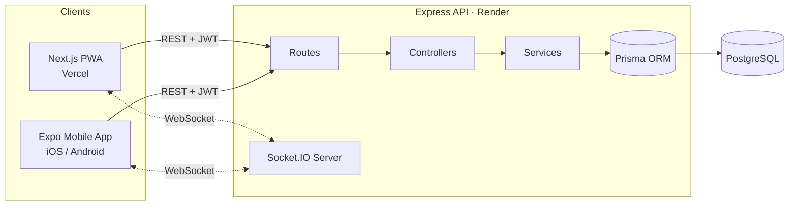

# BloodBank Finder

A full-stack, real-time blood donation and emergency-response platform connecting hospitals, blood banks, and donors — with geo-matched donor discovery, live inventory tracking, and on-demand ambulance dispatch.

<p align="center">
  <a href="https://www.typescriptlang.org/"></a>
  <a href="https://nodejs.org/"></a>
  <a href="https://expressjs.com/"></a>
  <a href="https://www.postgresql.org/"></a>
  <a href="https://www.prisma.io/"></a>
  <br>
  <a href="https://nextjs.org/"></a>
  <a href="https://react.dev/"></a>
  <a href="https://expo.dev/"></a>
  <a href="https://socket.io/"></a>
</p>

## Live Demo

| | |
|---|---|
| Web app | [blood-bank-finder.vercel.app](https://blood-bank-finder.vercel.app/) |
| API | [bloodbank-finder-api.onrender.com](https://bloodbank-finder-api.onrender.com) |

> Hosted on free-tier infrastructure — the API spins down when idle, so the first request after inactivity can take 30–50 seconds to wake it up.

## Overview

BloodBank Finder solves a real coordination problem: when a hospital needs blood urgently, who has it, how much, and how fast can a compatible donor get there? The platform models three cooperating roles — **donors**, **hospitals/blood banks**, and **admins** — and layers in real-time notifications, geospatial donor matching by blood-type compatibility, and an ambulance dispatch workflow for getting donors or patients where they need to be.

It ships as three coordinated client apps sharing one backend:

- A **Next.js Progressive Web App** for desktop and mobile browsers
- A **native Expo / React Native app** for iOS and Android
- An **Express + PostgreSQL API** that powers both, with a Socket.IO layer for real-time updates

## Features

**For Donors**
- Register with blood group, location, and availability
- Real-time alert the moment a compatible, in-range request opens — pushed over WebSocket, plus email and SMS, no polling
- One-tap "offer to donate" with automatic distance-to-request calculation
- Donation history and an eligibility check that enforces a minimum interval between donations
- Toggle availability for matching on/off at any time

**For Hospitals & Blood Banks**
- Post emergency blood requests with blood group, units needed, urgency level, and auto-expiry
- The backend automatically finds and notifies every compatible, eligible, nearby donor using a blood-type compatibility matrix combined with a Haversine-distance radius search
- Track responses live as donors offer, get confirmed, and complete donations
- Blood banks: manage live inventory per blood group, with automatic low-stock alerts
- Search available donors directly by blood group and location
- Dispatch an ambulance for a confirmed donor or for patient transport, and track it through assigned → en route → arrived → completed in real time

**For Admins**
- Review and verify newly registered organizations before they can post requests or appear in search
- System-wide stats overview

**Cross-cutting**
- Real-time updates everywhere via Socket.IO — new requests, donor offers, status changes, ambulance tracking, notifications
- Every notification is also delivered by email (Resend) and SMS (Twilio), alongside the in-app feed
- Role-based access control across donor / hospital / blood bank / admin
- Installable PWA — web manifest, custom service worker, "Add to Home Screen," cache-first static assets
- Map-based search (Leaflet / OpenStreetMap) with an adjustable search radius
- Native mobile app with full feature parity for requests, responses, ambulance dispatch, and notifications

## Architecture



Request flow: **route → middleware (auth / validate / rate-limit) → controller → service (business logic + Prisma) → database**, with services emitting Socket.IO events to push live updates back to connected clients.

## Tech Stack

**Backend** (`/server`)

| | |
|---|---|
| Runtime | [Node.js](https://nodejs.org/), [TypeScript](https://www.typescriptlang.org/) |
| Framework | [Express](https://expressjs.com/) 5 |
| Database | [PostgreSQL](https://www.postgresql.org/) + [Prisma](https://www.prisma.io/) ORM 6 |
| Real-time | [Socket.IO](https://socket.io/) 4 (JWT-authenticated connections, per-user rooms) |
| Email | [Resend](https://resend.com/) |
| SMS | [Twilio](https://www.twilio.com/) |
| Auth | [JWT](https://jwt.io/) ([jsonwebtoken](https://www.npmjs.com/package/jsonwebtoken)) + [bcryptjs](https://www.npmjs.com/package/bcryptjs) password hashing |
| Validation | [Zod](https://zod.dev/) schemas on every route |
| Security | [Helmet](https://helmetjs.github.io/), CORS, tiered [express-rate-limit](https://www.npmjs.com/package/express-rate-limit) |
| Testing | [Vitest](https://vitest.dev/) + [Supertest](https://www.npmjs.com/package/supertest) — 82 unit/integration tests |

**Web** (`/web`)

| | |
|---|---|
| Framework | [Next.js](https://nextjs.org/) 16 (App Router) + [React](https://react.dev/) 19 |
| Styling | [Tailwind CSS](https://tailwindcss.com/) 4, custom red theme |
| Maps | [Leaflet](https://leafletjs.com/) / [react-leaflet](https://react-leaflet.js.org/) (OpenStreetMap — no API key required) |
| Real-time | [Socket.IO](https://socket.io/) client |
| PWA | Web manifest + custom service worker (installable, cache-first static assets) |
| Icons | [lucide-react](https://lucide.dev/) |

**Mobile** (`/mobile`)

| | |
|---|---|
| Framework | [Expo](https://expo.dev/) 56 + [React Native](https://reactnative.dev/) 0.85 |
| Navigation | [React Navigation](https://reactnavigation.org/) (native-stack + bottom-tabs) |
| Real-time | [Socket.IO](https://socket.io/) client |
| Location | [expo-location](https://docs.expo.dev/versions/latest/sdk/location/) |
| Secure storage | [expo-secure-store](https://docs.expo.dev/versions/latest/sdk/securestore/) (JWT persistence) |

## Project Structure

```
BloodBank-Finder/
├── server/                  Express API
│   ├── src/
│   │   ├── routes/          auth, donors, organizations, requests, ambulances, inventory, notifications, admin, stats
│   │   ├── controllers/     Request handlers
│   │   ├── services/        Business logic — matching, requests, ambulance, notifications, inventory, eligibility
│   │   ├── middleware/      Auth, role guards, validation, rate limiting
│   │   ├── schemas/         Zod validation schemas
│   │   ├── sockets/         Socket.IO server + event handlers
│   │   ├── utils/           Blood-type compatibility matrix, Haversine distance, JWT, eligibility
│   │   └── config/          Env parsing, Prisma client
│   ├── prisma/               Schema, migrations, seed script
│   └── tests/                 Unit + integration tests (Vitest)
├── web/                       Next.js PWA
│   └── app/                   App Router pages — role dashboards, requests, ambulance tracking, admin
├── mobile/                    Expo / React Native app
│   └── src/
│       ├── screens/           auth, home, requests, ambulance, notifications, profile, search
│       ├── navigation/        Stack/tab navigators per section
│       └── context/           Auth + Socket context providers
└── render.yaml                 Render Blueprint — API + PostgreSQL, one-click deploy
```

## Data Model

PostgreSQL schema managed by Prisma — 9 models:

| Model | Purpose |
|---|---|
| `User` | Auth identity; role is one of `DONOR`, `HOSPITAL`, `BLOOD_BANK`, `ADMIN` |
| `DonorProfile` | Blood group, location, availability, donation history |
| `Organization` | Hospital/blood bank profile, location, verification status |
| `InventoryItem` | Units on hand per blood group per organization |
| `EmergencyRequest` | A blood request — group, units, urgency, status, expiry |
| `RequestResponse` | A donor's offer/confirmation against a request |
| `Ambulance` | A registered vehicle and driver, owned by an organization |
| `AmbulanceRequest` | A dispatch — pickup/dropoff, assigned ambulance, live status |
| `Notification` | Per-user in-app notification feed |

All 8 blood groups (`A_POS` … `O_NEG`) are modeled with a full compatibility matrix that drives donor matching — e.g. `O_NEG` can donate to all 8 groups, while `AB_POS` can only receive from all groups but donate to `AB_POS`.

## Real-Time Events (Socket.IO)

| Event | Fired when |
|---|---|
| `request:new` | A new emergency request matches a donor's blood group and search radius |
| `request:updated` | A request's status or fulfilled-units count changes |
| `response:new` | A donor offers to fulfill a request |
| `response:updated` | An offer is confirmed, completed, declined, or cancelled |
| `ambulance:updated` | An ambulance dispatch is assigned or its status changes |
| `notification:new` | Any new notification is created for a user |

## API Overview

All endpoints are prefixed with `/api`. Auth uses JWT bearer tokens; protected routes enforce `DONOR` / `HOSPITAL` / `BLOOD_BANK` / `ADMIN` access.

| Resource | Endpoints |
|---|---|
| Auth | `POST /auth/register/donor`, `POST /auth/register/organization`, `POST /auth/login`, `POST /auth/logout`, `GET /auth/me` |
| Donors | `GET/PUT /donors/me`, `GET /donors/me/donations`, `GET /donors/search` |
| Organizations | `GET /organizations/search`, `GET/PUT /organizations/me`, `GET /organizations/:id` |
| Requests | `POST /requests`, `GET /requests`, `GET /requests/:id`, `PATCH /requests/:id`, `POST /requests/:id/responses`, `PATCH /requests/:id/responses/:responseId` |
| Ambulances | `POST/GET /ambulances`, `PATCH /ambulances/:id`, `POST/GET /ambulances/requests`, `GET/PATCH /ambulances/requests/:id` |
| Inventory | `GET/PUT /inventory/me` |
| Notifications | `GET /notifications`, `PATCH /notifications/:id/read`, `PATCH /notifications/read-all` |
| Admin | `GET /admin/organizations`, `PATCH /admin/organizations/:id/verify` |
| Stats | `GET /stats/overview` |

## Security

- Passwords hashed with bcrypt (10 salt rounds)
- JWT-based auth with role-based access control on every protected route
- Zod validation on every request body, query, and param
- Tiered rate limiting — stricter limits on auth and request-creation endpoints
- Helmet security headers and a configurable CORS origin
- Ownership checks in the service layer — an organization can only modify its own requests, inventory, and ambulances

## Testing

82 automated tests (Vitest + Supertest):

- **Unit** — blood-type compatibility matrix, Haversine distance calculation, donation eligibility rules
- **Integration** — auth flows, organization management, the full emergency-request lifecycle (create → match → offer → confirm → complete), ambulance dispatch, notifications, and donor search

```bash
cd server
npm test
```

## Getting Started

### Prerequisites
- Node.js 18+
- PostgreSQL (local or hosted)

### 1. Clone
```bash
git clone https://github.com/PerinbaBuilds/BloodBank-Finder.git
cd BloodBank-Finder
```

### 2. Backend
```bash
cd server
npm install
cp .env.example .env      # fill in DATABASE_URL, JWT_SECRET, etc.
npx prisma migrate dev
npm run seed                # optional: loads demo organizations, donors, and a sample request
npm run dev                  # http://localhost:4000
```

### 3. Web app
```bash
cd web
npm install
npm run dev                  # http://localhost:3000
```

### 4. Mobile app
```bash
cd mobile
npm install
npx expo start
```

### Environment variables

**`server/.env`**

| Variable | Purpose |
|---|---|
| `DATABASE_URL` | PostgreSQL connection string |
| `PORT` | API port (default `4000`) |
| `JWT_SECRET` | Secret used to sign auth tokens |
| `JWT_EXPIRES_IN` | Token lifetime (default `7d`) |
| `CORS_ORIGIN` | Allowed origin for the web app |
| `DEFAULT_MATCH_RADIUS_KM` | Search radius for donor matching (default `15`) |
| `MIN_DONATION_INTERVAL_DAYS` | Minimum days required between donations (default `90`) |
| `LOW_STOCK_THRESHOLD` | Units at or below which a low-stock alert fires (default `5`) |
| `RESEND_API_KEY` | [Resend](https://resend.com/) API key for sending notification emails; leave unset to disable email |
| `EMAIL_FROM` | Sender address for outgoing email (default `BloodBank Finder <onboarding@resend.dev>`) |
| `TWILIO_ACCOUNT_SID` | [Twilio](https://www.twilio.com/) account SID for sending notification SMS; leave unset to disable SMS |
| `TWILIO_AUTH_TOKEN` | Twilio auth token |
| `TWILIO_PHONE_NUMBER` | Twilio phone number to send SMS from, in E.164 format |

**`web/.env.local`**

| Variable | Purpose |
|---|---|
| `NEXT_PUBLIC_API_URL` | Base URL of the API, including `/api` |
| `NEXT_PUBLIC_SOCKET_URL` | Base URL of the API for the Socket.IO connection |

## Deployment

The API and database deploy as a single [Render Blueprint](https://render.com/docs/blueprint-spec) defined in [`render.yaml`](./render.yaml) — a free-tier web service plus a managed PostgreSQL instance, with migrations run automatically on every deploy. The web app deploys separately to Vercel with the root directory set to `web`. This repository's live demo runs on exactly this setup.

## Demo Accounts

All seeded accounts use the password `Password123!`.

| Role | Email |
|---|---|
| Admin | `admin@bloodbankfinder.org` |
| Blood Bank | `central@bloodbank.demo`, `adyar@bloodbank.demo`, `velachery@bloodbank.demo` |
| Hospital | `mylapore@hospital.demo`, `tnagar@hospital.demo` |
| Donor | `donor1@demo.com` … `donor10@demo.com` |

## Admin Setup

The seeded admin account above is for local development only. For a real deployment, create your own admin account instead of relying on seed data:

```bash
cd server
ADMIN_EMAIL=you@example.com ADMIN_PASSWORD=choose-a-strong-password npm run create-admin
```

Omit `ADMIN_PASSWORD` to have a random one generated and printed once. The script refuses to run if an account with that email already exists, so it's safe to keep around. Never commit real admin credentials to this repository.

## Roadmap

- Inter-blood-bank stock transfer requests, so a low-stock bank can pull units from a nearby bank with surplus
- Automated donor eligibility/cooldown reminders as the next allowed donation date approaches

## Author

Built by [PerinbaBuilds](https://github.com/PerinbaBuilds).
