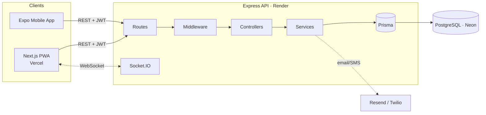

# BloodBank Finder &nbsp;[](https://github.com/PerinbaBuilds/BloodBank-Finder/actions/workflows/ci.yml)

When a hospital needs blood urgently, BloodBank Finder finds nearby, blood-type-compatible donors and alerts them in real time — matched by compatibility and distance, *the moment* the request is posted.

**Live app:** https://blood-bank-finder.vercel.app/ &nbsp;·&nbsp; **API:** https://bloodbank-finder-api.onrender.com

<p>
  <a href="https://www.typescriptlang.org/"></a>
  <a href="https://nodejs.org/"></a>
  <a href="https://expressjs.com/"></a>
  <a href="https://www.postgresql.org/"></a>
  <a href="https://www.prisma.io/"></a>
  <a href="https://nextjs.org/"></a>
  <a href="https://react.dev/"></a>
  <a href="https://socket.io/"></a>
  <a href="https://github.com/PerinbaBuilds/BloodBank-Finder/actions"></a>
  <a href="https://vercel.com/"></a>
</p>

> Hosted on free-tier infrastructure — the API spins down when idle, so the first request after inactivity can take 30–50 seconds to wake it up.

## Why this exists

When a hospital needs a rare blood type urgently, the hard part isn't storing records — it's answering *"who nearby can give this, right now?"* fast enough to matter. BloodBank Finder was built to close that gap: model donors, hospitals, and blood banks as one live network, and push each emergency request to every compatible, in-range, eligible donor the instant it's created — over the app, email, and SMS.

## How It Works

1. **A hospital or blood bank posts an emergency request** — blood group, units needed, urgency, auto-expiry.
2. **The backend finds who can help** — every donor whose blood type is *compatible* with the request (via a donor→recipient compatibility matrix), who is *available*, *eligible* (past the minimum interval since their last donation), and *within range* (Haversine distance).
3. **Matched donors are alerted instantly** — in-app over WebSocket, plus email and SMS. No polling.
4. **Donors respond and the loop closes** — a donor offers with one tap, the organization confirms, an ambulance can be dispatched and tracked live, and once the units are met the request closes automatically so no one else is pinged.

The full runtime walkthrough — the matching pipeline, real-time layer, and deployment topology — is in **[`docs/ARCHITECTURE.md`](./docs/ARCHITECTURE.md)**.

## Features

- **Post a request, reach every nearby compatible donor** in one action — no manual phone tree.
- **Real-time alerts** to donors over the app, email, and SMS the moment a matching request opens.
- **Live blood-bank inventory** per blood group, with automatic low-stock alerts.
- **Map-based search** for hospitals, blood banks, and available donors within an adjustable radius.
- **On-demand ambulance dispatch**, tracked from assigned → en route → arrived → completed.
- **Admin verification** so only vetted organizations can post requests or appear in search.

## Tech Stack

**Backend** (`/server`)

| Layer | Choice | Why |
|---|---|---|
| Runtime | Node.js + TypeScript | — |
| Framework | Express 5 | Minimal surface; middleware pipeline maps cleanly to route → auth → validate → controller |
| Database | PostgreSQL + Prisma ORM 6 | Relational integrity across a 9-model domain; Prisma gives type-safe queries + versioned migrations |
| Real-time | Socket.IO 4 | Per-user rooms + JWT handshake auth for *targeted* pushes, not broadcast spam |
| Validation | Zod | One schema per route validates body/query/params before any logic runs |
| Email / SMS | Resend / Twilio | Best-effort, swappable, and disabled by simply leaving keys unset |
| Auth | JWT + bcrypt | Stateless tokens; role is re-read from the DB per request so changes take effect instantly |
| Testing | Vitest + Supertest | 100+ unit/integration tests, incl. the full request lifecycle |

**Web** (`/web`)

| Layer | Choice | Why |
|---|---|---|
| Framework | Next.js 16 (App Router) + React 19 | — |
| Styling | Tailwind CSS 4 | — |
| Maps | Leaflet / react-leaflet (OpenStreetMap) | No API key or billing to run the demo |
| PWA | Web manifest + custom service worker | Installable, cache-first static assets |

**Mobile** (`/mobile`) — Expo / React Native, sharing the same API and Socket.IO layer.

## Architecture

Three clients, one backend that owns all domain logic and is the only thing that touches the database.



Request flow: **route → middleware (auth / validate / rate-limit) → controller → service (business logic + Prisma) → database**, with services emitting Socket.IO events to push live updates back to clients. Full detail, diagrams, and the matching algorithm: **[`docs/ARCHITECTURE.md`](./docs/ARCHITECTURE.md)**.

## Getting Started

**Requirements:** Node.js 18+, and PostgreSQL 14+ — *or* just Docker.

### Option A — Docker (one command)

```bash
git clone https://github.com/PerinbaBuilds/BloodBank-Finder.git
cd BloodBank-Finder
docker compose up --build              # API → :4000 · Web → :3000 · Postgres → :5432
docker compose exec api npm run seed   # load demo data (optional)
```

### Option B — Local

```bash
git clone https://github.com/PerinbaBuilds/BloodBank-Finder.git
cd BloodBank-Finder

# 1. Backend
cd server
cp .env.example .env          # fill in DATABASE_URL, JWT_SECRET, etc.
npm install
npx prisma migrate dev
npm run seed                  # optional: demo orgs, donors, and requests
npm run dev                   # http://localhost:4000

# 2. Web app (new terminal)
cd ../web
cp .env.example .env.local    # defaults point at the local API
npm install
npm run dev                   # http://localhost:3000
```

Environment variables are documented inline in [`server/.env.example`](./server/.env.example) and [`web/.env.example`](./web/.env.example).

## Usage

**Try the seeded demo accounts** (all use the password `Password123!`):

| Role | Email |
|---|---|
| Admin | `admin@bloodbankfinder.org` |
| Blood Bank | `central@bloodbank.demo` |
| Hospital | `mylapore@hospital.demo` |
| Donor | `donor1@demo.com` … `donor18@demo.com` |

Or hit the API directly:

```bash
# Log in and grab a token
curl -X POST http://localhost:4000/api/auth/login \
  -H "Content-Type: application/json" \
  -d '{"email":"mylapore@hospital.demo","password":"Password123!"}'

# Post an emergency request (as that hospital)
curl -X POST http://localhost:4000/api/requests \
  -H "Authorization: Bearer <token>" -H "Content-Type: application/json" \
  -d '{"bloodGroup":"O-","unitsNeeded":3,"urgency":"CRITICAL"}'
```

Posting the request triggers the matching pipeline and notifies every compatible, in-range, eligible donor.

### Admin setup for a real deployment

The seeded admin is for local use only. For production, create your own:

```bash
cd server
ADMIN_EMAIL=you@example.com ADMIN_PASSWORD=choose-a-strong-password npm run create-admin
```

Omit `ADMIN_PASSWORD` to have one generated and printed once. Never commit real credentials.

## Known Limitations / What I'd Do Differently

Being honest about the edges:

- **Free-tier cold starts.** The API (Render) and database (Neon) sleep when idle, so the first request after inactivity takes ~30–50s. A paid instance or a keep-alive ping fixes it.
- **Matching is in-process Haversine, not a spatial index.** Correct and fast for a city's worth of donors; at much larger scale I'd move to PostGIS (`GiST` / `earthdistance`) rather than filtering in memory.
- **Notifications are best-effort, no retry.** Email/SMS sends are fire-and-forget around the in-app source of truth. At scale I'd put them behind a durable queue (Redis + BullMQ) with retries and dead-lettering.
- **No web-app test suite yet.** The API has 100+ Vitest/Supertest tests; the web app relies on typecheck + lint + build in CI. Playwright end-to-end tests are the obvious next step.
- **Email deliverability** depends on verifying a domain in Resend — the default sender only reaches the account owner until then.

## License

[MIT](./LICENSE) © Perinba Athiban
