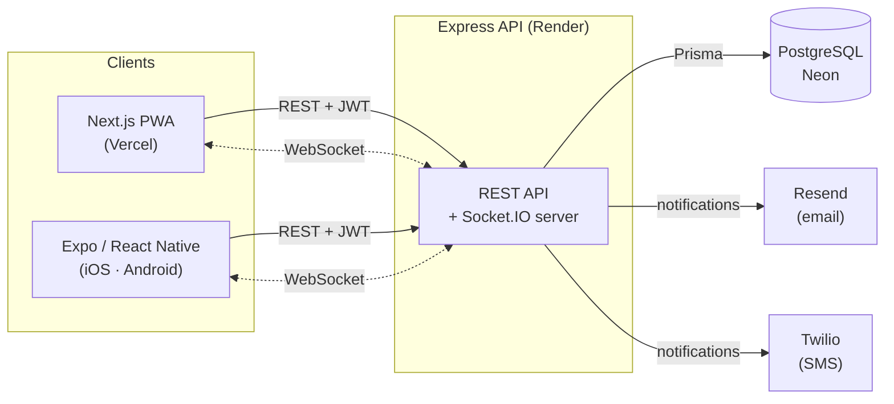
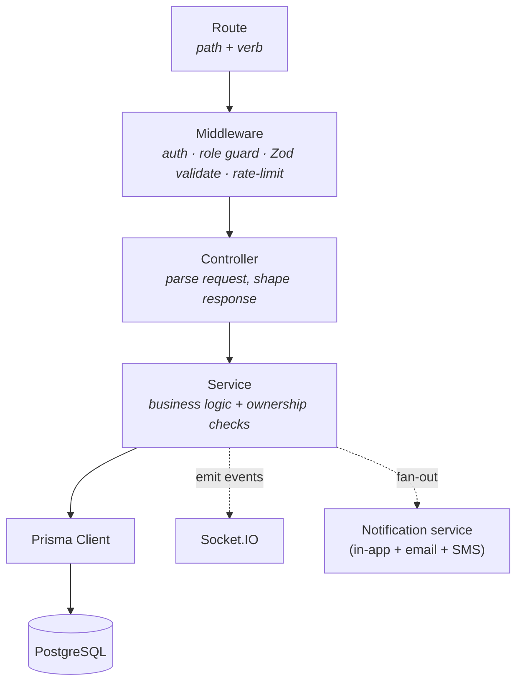
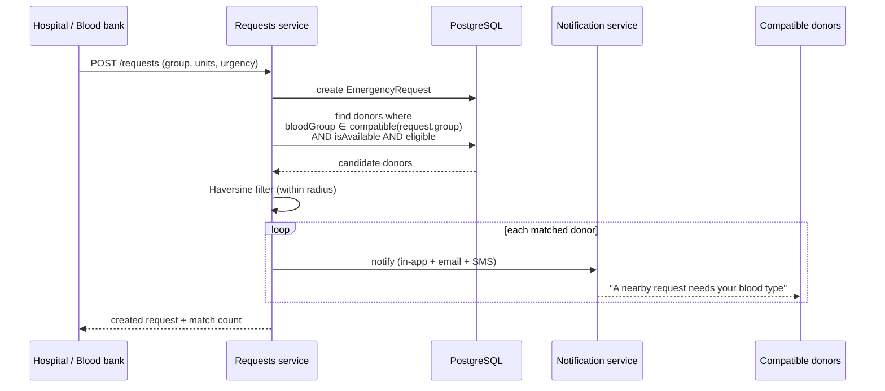
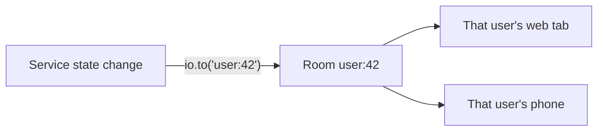
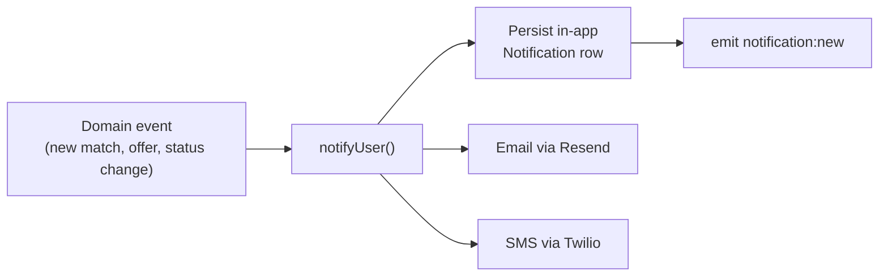
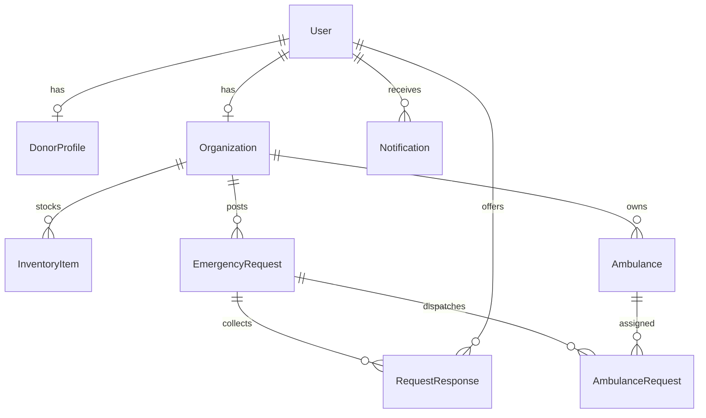
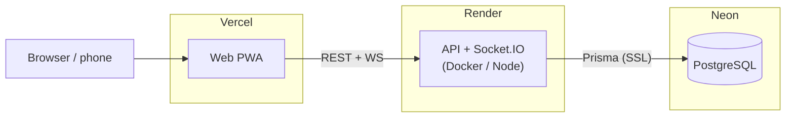

# Architecture

A detailed tour of how **BloodBank Finder** is put together — the moving parts, how a
request flows through them, the one algorithm that matters, and how it all deploys.

For _what_ the system must do, see [`SRS.md`](./SRS.md); for the broader design
rationale, see [`DESIGN.md`](./DESIGN.md). This document focuses on the runtime
architecture.

---

## 1. System context

Three clients share a single backend. The backend owns all business logic and is the
only thing that talks to the database.



**Why one backend, two front-ends?** The web PWA and the native app need identical
domain rules (blood-type compatibility, eligibility, matching, ownership checks).
Duplicating that in each client would drift; instead both are thin and the server is
the single source of truth.

---

## 2. Backend layering

Every request travels through the same pipeline. Each layer has one job.



| Layer | Responsibility | Lives in |
|---|---|---|
| **Routes** | Map HTTP verb + path to a controller; attach per-route middleware | `src/routes/` |
| **Middleware** | Authenticate (JWT), enforce role, validate body/query/params with Zod, rate-limit | `src/middleware/` |
| **Controllers** | Translate HTTP ⇄ service calls; no business logic | `src/controllers/` |
| **Services** | All business logic; the only layer that touches Prisma; emits real-time events | `src/services/` |
| **Utils** | Pure functions — blood-type compatibility matrix, Haversine distance, JWT, eligibility | `src/utils/` |
| **Sockets** | Socket.IO server, JWT handshake auth, per-user rooms | `src/sockets/` |

**Key rule:** controllers never contain domain logic and never import Prisma directly.
That keeps business rules testable in isolation and impossible to bypass from a new
route.

---

## 3. The request-matching pipeline

This is the one genuinely interesting piece. When an organization posts an emergency
request, the server has to answer: _who should we alert?_ — quickly, and correctly by
blood type.



Two pure functions do the heavy lifting, which makes them trivial to unit-test:

- **Compatibility matrix** (`utils/blood.ts`) — for a requested group, which donor
  groups can give? e.g. `O-` is the universal donor; `AB+` can receive from anyone.
  The matrix is the direction that matters (donor → recipient), not string equality.
- **Haversine distance** (`utils/haversine`) — great-circle distance between the
  request and each donor, filtered against `DEFAULT_MATCH_RADIUS_KM`.
- **Eligibility** (`utils/eligibility`) — enforces `MIN_DONATION_INTERVAL_DAYS`
  between donations and the donor's availability toggle.

**Design decision / tradeoff:** matching runs as an in-process query + in-memory
distance filter rather than PostGIS or a geo-index. At the scale this is built for
(a city's donors), a straightforward indexed query plus Haversine is simpler, has no
extra infrastructure, and is fast enough. If donor volume grew by orders of magnitude,
the honest next step is a spatial index (PostGIS `earthdistance`/`GiST`).

---

## 4. Real-time layer

Socket.IO runs alongside the REST API on the same HTTP server.

- **Auth:** the client presents its JWT in the connection handshake; the server
  verifies it and joins the socket to a per-user room (`user:<id>`).
- **Emit points:** services emit after a state change — `request:new`,
  `request:updated`, `response:new`, `response:updated`, `ambulance:updated`,
  `notification:new` — targeted at the specific rooms that care.
- **Client:** the web/native apps hold one socket for the session and refetch or patch
  local state on the relevant event, so dashboards update without polling.



---

## 5. Notification fan-out

One call, three channels, best-effort.



Email and SMS are **best-effort and non-blocking**: if `RESEND_API_KEY` /
`TWILIO_*` are unset, or the provider errors, the send is skipped/swallowed and the
in-app notification (the source of truth) still lands. A user is never blocked from an
action because a third-party notifier was down.

---

## 6. Data model

PostgreSQL, managed by Prisma — nine models. Summary of relationships:



| Model | Purpose |
|---|---|
| `User` | Auth identity; role ∈ `DONOR` / `HOSPITAL` / `BLOOD_BANK` / `ADMIN` |
| `DonorProfile` | Blood group, location, height/weight, availability, donation & health history |
| `Organization` | Hospital/blood-bank profile, location, verification status |
| `InventoryItem` | Units on hand per blood group per organization |
| `EmergencyRequest` | A blood request — group, units, urgency, status, expiry |
| `RequestResponse` | A donor's offer/confirmation against a request |
| `Ambulance` | A registered vehicle + driver owned by an organization |
| `AmbulanceRequest` | A dispatch — pickup/dropoff, assigned vehicle, live status |
| `Notification` | Per-user in-app notification feed |

Schema and migrations live in [`../server/prisma`](../server/prisma).

---

## 7. Security model

- **Passwords:** bcrypt (10 rounds).
- **Auth:** JWT bearer tokens; role read from the **database** on each protected
  request (not trusted from the token), so a role change takes effect immediately.
- **Validation:** every body, query, and param is parsed by a Zod schema before it
  reaches a controller.
- **Authorization:** ownership checks in the service layer — an org can only mutate
  its own requests/inventory/ambulances; only the requesting org can confirm or
  complete a donation offer; a request's responder list is visible only to the owning
  org (a donor sees only their own response).
- **Rate limiting:** tiered — stricter on auth and request-creation endpoints.
- **Transport:** Helmet security headers, configurable CORS origin, `httpOnly`
  cookie option for the token.

---

## 8. Deployment topology



- **Web** → Vercel (root dir `web`).
- **API** → Render web service. On deploy it runs `prisma migrate deploy` then starts,
  so schema changes ship with code. Defined in [`../render.yaml`](../render.yaml); a
  `Dockerfile` is also provided for portable/container deploys.
- **Database** → Neon (serverless PostgreSQL). `DATABASE_URL` is injected as an
  environment variable, not committed.

**Free-tier note:** the API sleeps after inactivity, so the first request after idle
incurs a ~30–50s cold start while the instance (and Neon compute) wake.

---

## 9. Where to look in the code

```
server/src/
├── routes/          auth, donors, organizations, requests, ambulances,
│                    inventory, notifications, admin, stats
├── controllers/     HTTP ⇄ service glue
├── services/        business logic — matching, requests, ambulance,
│                    notifications, inventory, eligibility
├── middleware/      auth, role guards, Zod validation, rate limiting
├── schemas/         Zod validation schemas
├── sockets/         Socket.IO server + handlers
├── utils/           blood compatibility, Haversine, JWT, eligibility
└── config/          env parsing, Prisma client
```
